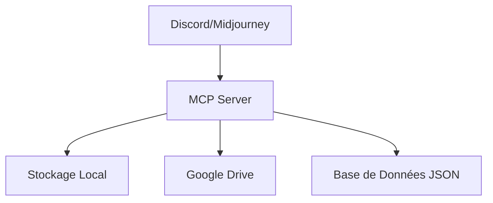

# Infrastructure pour la Génération et le Stockage des Illustrations

## Architecture Générale



## 1. Serveur MCP Discord/Midjourney

### Fonctionnalités
- Connexion à Discord via API
- Envoi automatisé des prompts
- Récupération des images générées
- Gestion des métadonnées

### Outils
```typescript
// Exemples de fonctions
generateImage(prompt: string): Promise<ImageResult>
saveImageMetadata(image: ImageResult): Promise<void>
uploadToGDrive(image: ImageResult): Promise<string>
```

## 2. Structure de Stockage Local

### Organisation des Dossiers
```
illustrations/
├── raw/                    # Images brutes de Midjourney
│   ├── personnages/
│   ├── scenes/
│   └── elements/
├── processed/              # Images traitées
│   ├── personnages/
│   ├── scenes/
│   └── elements/
├── metadata/              # Fichiers JSON de métadonnées
└── versions/             # Historique des versions
```

### Système de Nommage
```
{type}_{sujet}_{version}_{timestamp}.{ext}
```
Exemple : `personnage_ecureuil_v1_20250225093000.png`

## 3. Intégration Google Drive

### Structure Drive
```
Livre-Illustrations/
├── Bruts/
├── Finals/
├── Tests/
└── Metadata/
```

### Configuration
```json
{
  "drive": {
    "folderId": "...",
    "backupFrequency": "realtime",
    "structureMirror": true
  }
}
```

## 4. Base de Données JSON

### Structure des Métadonnées
```json
{
  "images": {
    "id": "uuid",
    "filename": "string",
    "prompt": "string",
    "type": "personnage|scene|element",
    "subject": "string",
    "version": "number",
    "timestamp": "ISO8601",
    "midjourney": {
      "params": {
        "style": "string",
        "stylize": "number",
        "chaos": "number",
        "seed": "number"
      }
    },
    "locations": {
      "local": "string",
      "gdrive": "string"
    },
    "status": "draft|final|archived",
    "tags": ["array"]
  }
}
```

## 5. Workflow Automatisé

### Génération d'Image
1. Réception de la demande
2. Formatage du prompt
3. Envoi à Midjourney
4. Attente et récupération
5. Traitement et stockage

### Sauvegarde
1. Stockage local
2. Création métadonnées
3. Sync Google Drive
4. Mise à jour DB

### Versioning
1. Conservation historique
2. Nommage incrémental
3. Liens métadonnées

## 6. Scripts d'Automatisation

### Discord Bot (MCP)
```typescript
class DiscordMidjourneyBot {
  async generateImage(prompt: string): Promise<string>
  async waitForCompletion(messageId: string): Promise<boolean>
  async downloadImage(url: string): Promise<Buffer>
}
```

### Gestionnaire de Fichiers
```typescript
class FileManager {
  async saveLocal(image: Buffer, metadata: ImageMetadata): Promise<string>
  async uploadDrive(path: string): Promise<string>
  async createVersion(imageId: string): Promise<string>
}
```

### Base de Données
```typescript
class MetadataManager {
  async saveMetadata(data: ImageMetadata): Promise<void>
  async updateStatus(imageId: string, status: string): Promise<void>
  async getHistory(imageId: string): Promise<ImageVersion[]>
}
```

## 7. Interface de Commandes

### Commandes Disponibles
```bash
# Génération
generate:character "prompt" --type personnage
generate:scene "prompt" --type scene

# Gestion
image:version <id> --create
image:status <id> --set final
image:sync --drive

# Utilitaires
utils:backup
utils:check-storage
utils:clean-temp
```

## 8. Monitoring et Maintenance

### Vérifications Automatiques
- Espace disque
- Synchronisation Drive
- Intégrité des données
- Liens cassés

### Alertes
- Erreurs de génération
- Échecs de sauvegarde
- Problèmes de sync
- Espace insuffisant

## 9. Sécurité et Sauvegarde

### Mesures de Sécurité
- Chiffrement des credentials
- Validation des prompts
- Contrôle d'accès
- Logs sécurisés

### Plan de Sauvegarde
- Backup local quotidien
- Sync Drive temps réel
- Export métadonnées hebdo
- Vérification intégrité

## Notes d'Implémentation
1. Créer le serveur MCP de base
2. Configurer l'authentification Discord
3. Mettre en place la structure locale
4. Configurer Google Drive
5. Développer les outils d'automatisation
6. Tester le workflow complet
7. Documenter l'utilisation